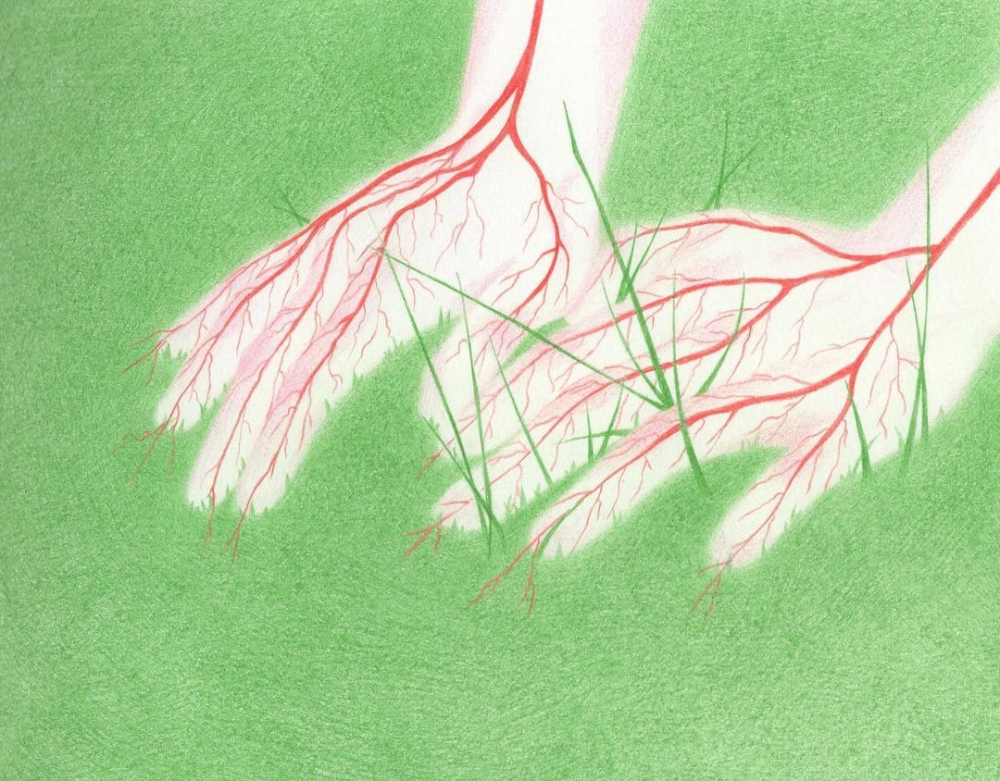

  

<h1 align="center">🚀 Samet Can ORUÇ</h1>
<h3 align="center">Elektronik Teknolojisi & Bilgisayar Programcılığı Öğrencisi</h3>

<h3 align="center">A computer programming and electronic technology student.</h3>

- 🔭 Currently working on **scent-tracking robot technology** and an **smart home** project.
- 🌱 Leading the avionics rocket systems.
- 📫 Reach me at: [sametcannoruc@gmail.com](mailto:sametcannoruc@gmail.com)

### 🌐 Connect with me:

  
  

### 💻 Languages and Tools:

  
  
  
  
  
  
  

